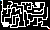

# TP2# Trabalho Prático 2 - O Labirinto

Neste trabalho, nosso objetivo é **criar um labirinto**. Nosso
objetivo é praticar os conceitos de projeção, iluminação, modelagem e
efeitos visuais vistos em sala de aula.
Um exemplo de labirinto pode ser visto no jogo [_"Keep Out"_][Keep Out].

Videos Keep Out:

[_"First Exploration!"_][First Exploration!]

[_"Demons Everywhere!"_][Demons Everywhere!]

[_"Death!"_][Death!]

[Keep Out]: http://www.playkeepout.com/
[Demons Everywhere!]: https://www.youtube.com/watch?v=0HXZA81ewN8
[Death!]: https://www.youtube.com/watch?v=F6s-lrX_Yk4
[First Exploration!]: https://www.youtube.com/watch?v=Efo14AGLWLg

Esse trabalho pode ser feito individualmente, ou em dupla, e
como funcionalidade básica, valendo 85% ou 75% (respectivamente) da
nota, deve ter os seguintes itens:

- **Mundo**:
  1. O mapa deve ser carregado apartir dos pixels de uma imagem, onde as cores:
    - Azul: Ponto inicial.
    - Vermelho: Ponto final.
    - Preto: Lugares inacessivéis.
    - Branco: Caminhos possíveis.
    Exemplo de Mapa:

    
    
  2. O personagem não pode atravessar objetos.
    
  Obs:  O caminho pode ser um plano;
        As paredes podem ser objetos da GLU e GLUT (Cubos)  ou planos cercando o caminho;
    
  2. O fim deve ser um teleport para o inicio.
- **Personagem**:
  - Ele deve possuir ao menos um corpo e 2 "pernas" para andar, deve executar algum movimento ao andar (Não precisa ser um movimento perfeito, mas pelomenos mexer apenas enquanto está andando).
    - Caso não queira modelá-lo com pernas, você pode criar algo semelhante,
      contanto que seja feita a modelagem de forma hierárquica (_i.e._, com
      `glPushMatrix()...glPopMatrix` aninhados)
  - Pode ser controlada pelo usuário com as _"arrow keys"_, onde:
    1. <kbd>A</kbd> ou <kbd>&larr;</kbd> rotacionam 90% para esquerda;
    1. <kbd>D</kbd> ou <kbd>&rarr;</kbd> rotacionam 90% para direita;
    1. <kbd>W</kbd> ou <kbd>&uarr;</kbd> andam para frente;
    1. <kbd>S</kbd> ou <kbd>&Darr;</kbd> andam para trás.
    
- **Câmera**:
  1. Você deve usar projeção perspectiva via `glFrustum` ou `gluPerspective`.
  2. Devem existir 2 tipos de câmeras:
  
      1 - Câmera posicionada atrás do personagem; 

      
      
      2 - Câmera em primeira pessoa.
      
      

  3. A Câmera deve:
    - Rotacionar 90º para esquerda ao apertar a tecla <kbd>A</kbd> ou <kbd>&larr;</kbd>;
    - Rotacionar 90º para direita ao apertar a tecla <kbd>D</kbd> ou <kbd>&rarr;</kbd>;
    - Movimentar junto com o personagem apartir das teclas <kbd>W</kbd> ou <kbd>&uarr;</kbd> para frente;
    - Movimentar junto com o personagem apartir das teclas <kbd>S</kbd> ou <kbd>&darr;</kbd> para trás;
- **Gráficos**:
  1. Você deve usar o modelo de
    [iluminação do OpenGL, devidamente configurado][lighting].
    - Basta que sua cena tenha 1
    [fonte de luz direcional][lighting-directional].
  1. Todas as paredes e objetos da cena devem ter materiais configurados (não
    necessariamente com textura).

Para se obter o restante dos pontos do trabalho (ou até mesmo mais pontos
extras, até um limite de **125%** da pontuação original) funcionalidades adicionais
podem/devem ser implementadas no jogo. Essas funcionalidades serão avaliadas
conforme a **dificuldade da implementação**, o **efeito obtido** com ela no
trabalho e a **qualidade da implementação**. Exemplos de funcionalidades
extras com suas respectivas pontuações **máximas**: 

- Relativas aos **Objetos**:
  1. :star2: **Vários tipos (até 10%)**: em vez de apenas um tipo (_e.g._,
    pedra), pode ter vários outros: tocha, caveira etc.
  1. :bomb: :boom: **Modelos no formato .obj (até 10%)**: em vez de usar os
    sólidos da GLU/GLUT, modele um objeto \*simples\* usando um _software_
    CAD, salve-o num formato \*simples\* (_e.g._, `.obj`) e carregue-o no
    seu programa. Há alguns tutoriais disponíveis nas _interwebs_ sobre
    como abrir um arquivo `.obj`, ler a informação sobre os vértices e
    desenhá-los... aqui estão alguns: [tutorial 1][obj-tut-1],
    [tutorial 2][obj-tut-2], [tutorial 3][obj-tut-3].
- Relativas ao **Mapa**:
  1. :bomb: :bomb: :boom: **Mapas de forma procedural (até 15%)**: em vez de carregar o mapa a partir da imagem, gere mapas aleatórios que obedeçam as restrições;
  1. :boom: **Multiplos Cenários(até 8%)**: em vez de instanciar um mapa unicio, crie outros mapas e mude ao passar de fase;
- Relativas ao **Personagem**:
  1. :bomb: :boom:**Animação de andar (até 10%)**: faça a movimentação correta do movimento das pernas ao andar de forma animada.
  1. :boom: **Física (até 7%)**: faça com que
    o personagem possa subir em objetos ao pular, por exemplo com a <kbd>barra de espaço</kbd>;
- Relativas à **Câmera**:
  1. **Botões na tela (5%)**: em vez de teclas do teclado para tudo, use
    botões clicáveis via _mouse_.
  1. Fonte de **luz pontual (5%)**: além da fonte luminosa direcional, crie uma
    ou mais fontes de luz pontuais em pontos estratégicos. Como por exemplo Tochas!
  1. :star2: **Reshape (5%)**: permitir o redimensionamento da janela
    de visualização sem perda da razão de aspecto (sem que haja distorção
    de achatamento/alongamento).
  1. :collision: **_Skybox_ (até 5%)**: se considerarmos que nosso mundo
    está definido dentro de um cubo, podemos colocar uma imagem de textura
    em cada face interna (6) que represente o horizonte naquela direção. Veja
    [exemplos de texturas de _skyboxes_][skybox] e nossa aula sobre
    [efeitos visuais][visual-fx]. Repare que o cubo _skybox_ acompanha
    a posição, ou seja, não é possível se aproximar (e até sair) do cubo.
- Outros adicionais:
  1. :star2: **Modo _cheat_ (+3%)**: faça com que uma linha mostre o caminho direto.
- Relativas a **Gráficos**:
  1. **Outro tema (até 3%)**: por que se limitar a fazer um simples
    labirinto, quando se pode libertar o ser criativo dentro de você!
  1. :star2: **Música (até 5%)**: você pode incluir ambientação sonora para
    seu labirinto que pode incluir uma música ambiente e efeitos sonoros.
- **Qualquer outra idéia (??%)** que torne o labirinto mais interessante ou
    agradável aos sentidos. Essas idéias precisam ser documentadas e
    explicadas no documento de entrega do trabalho (`README.txt`).

Legenda dos ícones:
  - :star2:: item sugerido por ser interessante ou super simplão.
  - :collision:: item com maior complexidade de implementação - não
    comece por estes!!
  - :bomb:: item com alta complexidade de implementação - Deixe para o fim!!
  - :bomb::bomb:: Bombas... nível hardcore!

## Instruções gerais

O trabalho pode ser feito individualmente ou em duplas e deve ser produzido
integralmente pelos aluno ou dupla. Podem discutir idéias com outros colegas,
mas cada aluno/dupla deve ter a sua implementação independente dos demais.
**Trabalhos muito semelhantes receberão notas muito semelhantes (iguais a 0)**,
independente de quem copiou de quem. Trabalhos semelhantes aos de outras
pessoas (ex-alunos, pessoas na Internet) também receberão nota 0.

## O que faz perder nota

Alguns descuidos podem fazer com que sua nota fique abaixo do esperado:
- Seu trabalho não executa: nota 0
- Cópia de trabalho de outrem: nota 0
- Ausência de qualquer item obrigatório da entrega (descrito na próxima seção)
- Ausência de itens da especificação obrigatória
- Baixa legibilidade do código
- Baixa qualidade da implementação
- Atraso na entrega. Cada dia de atraso reduz o valor máximo de nota da
 maneira abaixo. Considere `x` como dias de atraso e `y` a penalidade
 percentual na nota:

 
 - Isso implica que 1 ou 2 dias de atraso são pouco penalizados
 - E após 5 dias de atraso, o trabalho vale 0
 - _Seeing is believing_: https://www.google.com.br/search?q=y%3D(2%5E(x-2)%2F0.16)%2Cy%3D100

## O que deve ser **entregue**

Deve ser entregue **um arquivo .tar.gz ou .zip** via **Moodle** contendo:
 1. 3+ _screenshots_ de diferentes cenas do seu jogo
 1. Todo o programa fonte, com os _Makefiles_ e bibliotecas necessárias
    para a compilação e execução do programa
 1. O arquivo executável
 1. Um arquivo **README** contendo:
    - Instruções para **compilação e execução**
    - **Lista de itens adicionais** que seu jogo está pleiteando
 1. [opcional, +3%] O link para um vídeo breve (_e.g._, youtube) do
    seu jogo mostrando as opções implementadas.

Qualquer dúvida, entre em contato comigo. Ou acrescente a sua interpretação no
arquivo README e mãos à obra.

[skybox]: https://www.google.com.br/search?q=skybox&safe=off&hl=pt-BR&source=lnms&tbm=isch&sa=X&ei=jMM_VenRNKuasQSCwYDABw&ved=0CAgQ_AUoAg&biw=1366&bih=599
[lighting]: http://fegemo.github.io/cefet-cg/classes/lighting/#26
[lighting-directional]: http://fegemo.github.io/cefet-cg/classes/lighting/#37
[obj-tut-1]: http://www.opengl-tutorial.org/beginners-tutorials/tutorial-7-model-loading/
[obj-tut-2]: http://netization.blogspot.in/2014/10/loading-obj-files-in-opengl.html
[obj-tut-3]: https://tutorialsplay.com/opengl/2014/09/17/lesson-9-loading-wavefront-obj-3d-models/
[obj-distribution]: http://moodle.cefetmg.br/mod/forum/discuss.php?d=3572
[visual-fx]: http://fegemo.github.io/cefet-cg/classes/visual-effects/#4
[camera-lateral]: https://youtu.be/T7zdZ4VJ3nw
